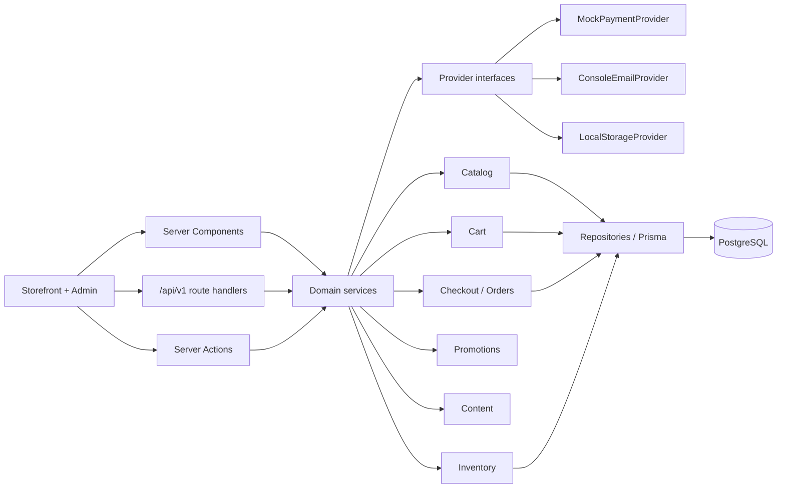
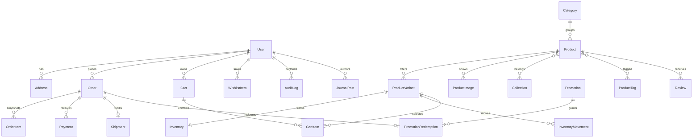
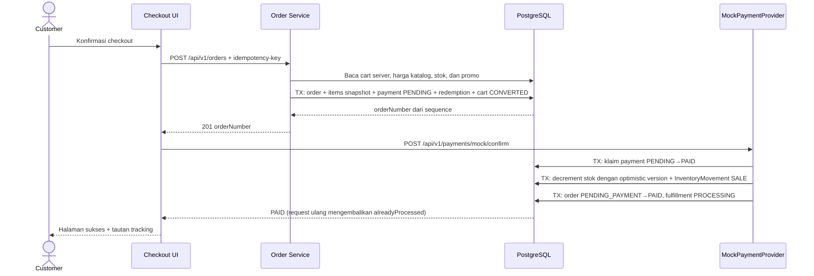

# Nusantara Wear

E-commerce fashion lokal full-stack berbasis Next.js App Router. Seluruh alur belanja berjalan di atas PostgreSQL: katalog, pencarian dan filter, variant dengan stok, cart persisten untuk tamu maupun akun, checkout lima tahap, payment mock transaksional, tracking privat, akun pelanggan, journal, dan admin console dengan audit trail.

**Tagline:** Ruang baru untuk cerita yang berakar.

## Stack

- Next.js 16 (App Router, Turbopack) + React 19 + TypeScript strict + React Server Components
- Tailwind CSS 4, shadcn/ui di atas Base UI, CSS variables, Lucide Icons
- PostgreSQL 17 + Prisma ORM 7 dengan driver adapter `pg`
- Auth.js/NextAuth credentials (bcrypt) dengan role `CUSTOMER`, `STAFF`, `ADMIN`
- Zod + React Hook Form, Zustand untuk snapshot cart di client
- Vitest + Testing Library + Playwright
- Provider abstraction untuk payment, storage, dan email — seluruh default gratis dan lokal

## Menjalankan

Prasyarat: Node 22+, pnpm 9+, dan PostgreSQL 17 (paling mudah lewat Docker).

```bash
pnpm install
cp .env.example .env
docker compose up -d
pnpm prisma:generate
pnpm db:migrate
pnpm db:seed
pnpm dev
```

Buka `http://localhost:3000`.

> **Database wajib tersedia.** Katalog, homepage, dan journal dirender dari PostgreSQL, termasuk saat `pnpm build` melakukan prerender. Pastikan `DATABASE_URL` dapat dijangkau sebelum menjalankan build, migration, seed, atau `pnpm test:e2e`.

Isi `AUTH_SECRET` dengan minimal 32 karakter acak:

```bash
node -e "console.log(require('node:crypto').randomBytes(32).toString('hex'))"
```

## Akun demo

| Peran | Email | Password |
|---|---|---|
| Admin | `admin@nusantarawear.test` | `Admin123!` |
| Staff | `staff@nusantarawear.test` | `Staff123!` |
| Customer | `demo@nusantarawear.test` | `Demo123!` |

Password disimpan sebagai bcrypt hash. Session memakai JWT dengan cookie `httpOnly`, `sameSite=lax`, dan `secure` otomatis di production. Seluruh halaman `/admin` serta mutation admin memeriksa role di server.

## Alur demo utama

1. Buka `/shop`. Saring berdasarkan kategori, koleksi, ukuran, warna, rentang harga, dan ketersediaan — semuanya tersimpan di URL dan dapat dibagikan.
2. Masuk ke PDP. Kombinasi warna × ukuran menentukan SKU, harga, dan stok; ukuran yang habis dinonaktifkan dan diberi teks status, bukan hanya warna.
3. Tambahkan ke tas. Cart tamu dibuat di server dengan cookie anonim `nw_anon` yang `httpOnly`; cart tetap ada setelah browser ditutup.
4. Terapkan `PERTAMA10` atau `BEBASONGKIR` di `/cart`. Evaluasi promo terjadi di server.
5. Checkout `/checkout`: kontak → alamat → kurir → pembayaran mock → tinjau. Quote dihitung ulang server setiap kali kurir berubah.
6. Konfirmasi pembayaran. Order dibuat idempotent, lalu stok berkurang **hanya setelah** payment `PAID` di dalam satu transaksi database.
7. `/checkout/sukses/[orderNumber]` menampilkan snapshot pesanan. Jika payment gagal, `/checkout/gagal?order=...` menyediakan tombol coba lagi.
8. Lacak di `/lacak-pesanan` dengan kombinasi nomor pesanan + email. Nomor saja tidak cukup.
9. Masuk sebagai customer untuk pesanan, alamat, dan wishlist. Cart tamu otomatis digabung ke cart akun tanpa item duplikat.
10. Masuk sebagai admin untuk `/admin`: dashboard, produk, inventory, orders, promo, customers, journal.

## Perintah

```bash
pnpm dev
pnpm lint
pnpm test
pnpm test:e2e
pnpm build
pnpm check
```

`pnpm test` menjalankan unit test murni (tanpa database) dan integration test terhadap PostgreSQL. Bila `DATABASE_URL` tidak dapat dijangkau, integration test otomatis di-skip dengan peringatan alih-alih gagal.

Playwright menjalankan project desktop Chromium dan Pixel 7. Instal browser sekali: `pnpm exec playwright install chromium`.

## Arsitektur

Modular monolith dipilih agar transaksi order, payment, dan inventory tetap sederhana serta atomik tanpa overhead microservices.

```text
src/
  app/            rute storefront, akun, admin, dan /api/v1
  components/     ui/, storefront/, commerce/, admin/, account/, auth/
  features/       cart/, wishlist/, account/, admin/ (state client + server actions)
  lib/            commerce.ts (rule murni), auth/, db/, payments/, storage/, email/, validation/, http.ts
  server/
    repositories/ query Prisma dan pemetaan baris
    services/     business rule server-only
prisma/           schema.prisma, migrations/, seed.ts, seed-data.ts
tests/            unit/, integration/, e2e/
```



Aturan yang dijaga:

- Harga, diskon, ongkir, total, eligibility promo, dan stok **selalu** dihitung ulang di server. Client tidak pernah mengirim harga.
- Rule murni (kalkulasi quote, evaluasi promo, state machine order, ketersediaan stok, merge cart) berada di `src/lib/commerce.ts` sehingga dapat diuji tanpa database.
- Seluruh nominal disimpan sebagai integer rupiah.
- Mutation penting (`POST /api/v1/orders`, `POST /api/v1/payments/mock/confirm`) mewajibkan header `idempotency-key`.
- Modul di `src/server` memakai `import "server-only"` agar tidak pernah ikut ke bundle client.

## ERD ringkas



Migration menambahkan hal yang tidak dapat diekspresikan Prisma schema saja: check constraint `onHand >= 0 AND reserved <= onHand`, partial unique index untuk satu cart aktif per user/anonymous ID, index trigram `pg_trgm` untuk pencarian produk, serta sequence `order_number_seq` untuk nomor pesanan yang tetap unik saat request bersamaan.

## Sequence checkout



Idempotency dijaga dua lapis: `Order.idempotencyKey` unik membuat pembuatan order berulang mengembalikan order yang sama, dan konfirmasi payment memakai `updateMany` bersyarat `status = PENDING` sehingga hanya satu request yang berhasil mengklaim dan mengurangi stok. Optimistic concurrency pada `Inventory.version` mencegah overselling ketika dua pembayaran diproses bersamaan.

## Endpoint

| Method | Path | Catatan |
|---|---|---|
| GET | `/api/v1/products` | filter, sort, dan page pagination |
| GET | `/api/v1/products/:slug` | detail lengkap dengan variant dan review |
| GET \| POST | `/api/v1/cart` | baca cart, tambah item |
| PATCH \| DELETE | `/api/v1/cart/items/:id` | ubah jumlah, simpan untuk nanti, hapus |
| POST | `/api/v1/cart/merge` | gabungkan cart tamu setelah login |
| POST | `/api/v1/checkout/quote` | hitung ulang subtotal, promo, ongkir, total |
| POST | `/api/v1/orders` | idempotent dan transactional |
| POST | `/api/v1/payments/mock/confirm` | payment, order, dan stok berubah atomik |
| GET | `/api/v1/orders/track` | butuh `orderNumber` + `email`, rate limited |
| GET \| POST | `/api/v1/wishlist` | wishlist pelanggan |
| POST | `/api/v1/auth/register` · `/forgot-password` · `/reset-password` | rate limited |
| GET/POST/PATCH/DELETE | `/api/v1/admin/*` | dashboard, products, inventory, orders, promotions, customers, journal |

Error selalu berbentuk `{ code, message, fieldErrors?, requestId }` dengan status HTTP yang sesuai. `requestId` juga dikirim sebagai header `x-request-id` dan diteruskan dari `src/proxy.ts`.

Rate limit aktif untuk login, register, reset password, validasi promo/quote, pembuatan order, konfirmasi payment, dan tracking.

## Provider

- **Payment** — `MockPaymentProvider` adalah default (`PAYMENT_PROVIDER=mock`). State mengikuti `PENDING`, `PAID`, `FAILED`, `EXPIRED`, `REFUNDED`. Midtrans atau Stripe cukup mengimplementasikan interface `PaymentProvider` di `src/lib/payments/provider.ts`.
- **Storage** — `LocalStorageProvider` memvalidasi MIME `image/*` dan batas 8 MB. Adapter object storage memakai interface `StorageProvider` yang sama.
- **Email** — `ConsoleEmailProvider` mencatat domain penerima, nomor pesanan, dan status. Alamat lengkap, password, token, dan data payment sensitif tidak pernah masuk log. Tautan reset password hanya dicetak di terminal saat `NODE_ENV !== "production"`.

## SEO dan performa

- Metadata unik per halaman, canonical, Open Graph, `robots.ts`, dan `sitemap.ts` yang dibangun dari produk aktif, koleksi, serta artikel terbit.
- JSON-LD `Organization` dan `WebSite` dengan `SearchAction` di homepage, `Product` + `Offer` + `AggregateRating` dan `BreadcrumbList` di PDP, serta `Article` di journal.
- Katalog memakai `revalidate` dan diinvalidasi lewat `revalidatePath` setiap kali admin mengubah produk atau stok.
- Gambar memakai `sizes` responsif dan blur placeholder lokal (data URI, tanpa request tambahan).

## Keamanan dan konsistensi data

- Password di-hash bcrypt cost 12; token reset disimpan sebagai SHA-256 digest dengan masa berlaku 30 menit.
- Permintaan reset password selalu membalas sukses agar tidak membocorkan email mana yang terdaftar.
- Role dicek di server pada layout `/admin`, seluruh server action admin, dan seluruh route `/api/v1/admin`.
- Tracking pesanan hanya terbuka bila nomor pesanan dan email cocok, dengan rate limit terpisah.
- Server Actions Next.js membawa proteksi CSRF bawaan; security header diatur di `next.config.ts`.
- Setiap perubahan admin tercatat di `AuditLog` beserta aktor, dan setiap perubahan stok menghasilkan `InventoryMovement` dengan alasan.
- Email pelanggan disamarkan di daftar admin.

## Testing

- **Unit** (`tests/unit`) — kalkulasi quote, promo percentage/fixed/free shipping beserta seluruh guard-nya, ketersediaan inventory, state transition order, merge cart, rate limit, dan bentuk error. Berjalan tanpa database.
- **Integration** (`tests/integration`) — terhadap PostgreSQL sungguhan: harga diambil dari katalog dan bukan dari input client, checkout ditolak saat stok kurang, order idempotent, stok berkurang tepat sekali walau konfirmasi payment diulang, promo tidak memenuhi syarat ditolak, privasi tracking, dan otorisasi admin.
- **E2E** (`tests/e2e`) — cari dan filter, pilih variant, tambah ke tas, pakai promo, guest checkout sampai halaman sukses, login customer melihat pesanan dan wishlist, login admin menyesuaikan stok, penolakan akses admin untuk pelanggan, navigasi mobile, filter drawer, dan dialog panduan ukuran lewat keyboard.

## Deployment

Target utama Vercel dengan PostgreSQL managed yang mendukung koneksi langsung `pg`.

1. Set environment variables dari `.env.example`, termasuk `DATABASE_URL` yang dapat dijangkau saat build.
2. Jalankan `pnpm prisma migrate deploy` sebagai langkah release.
3. Seed hanya pada environment demo.
4. Deploy build Next.js.

Gunakan connection pool sesuai penyedia dan jangan memberikan URL Prisma Accelerate ke `PrismaPg`.

## Batasan demo

- Payment adalah simulasi. Tidak ada gateway sungguhan yang dipanggil, dan konfirmasi berhasil segera setelah diminta.
- Upload gambar produk belum tersedia di UI admin; produk baru dibuat dengan satu gambar placeholder dan variant ditambahkan melalui seed. Interface `StorageProvider` sudah siap untuk menggantinya.
- Rate limit disimpan in-memory per proses sehingga cocok untuk satu instance. Production multi-instance memerlukan penyimpanan bersama seperti Redis atau KV.
- Newsletter hanya mencatat domain penerima ke log; tidak ada penyimpanan atau pengiriman nyata.
- Reservasi stok tidak dilakukan saat add-to-cart sesuai spesifikasi, sehingga `Inventory.reserved` selalu nol dan filter ketersediaan memakai `onHand`.
- Foto katalog adalah aset demo yang disimpan lokal; dua visual campaign dibuat khusus untuk proyek ini. Lihat `ASSET-LICENSES.md`.
